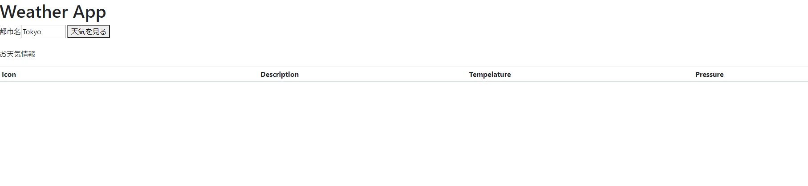
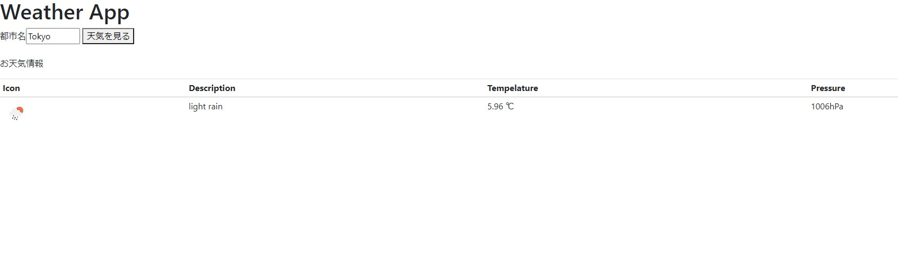
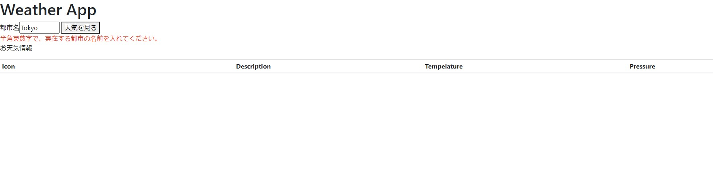

# go で作ったものを保存しておくリポジトリ  

## 1. goweather 
rakutenapi のopen-weather-mapを使って都市などの天気を表示するだけのアプリ  

### 作った目的  
- go の基本的な書き方の練習のため  
- 外部APIを使ってみるため
- フレームワークを使わずにアプリを作る体験をするため。
### 環境
- windows10
- go1.15
- Chromeで動作確認
 ### 使い方
 #### 前準備    
 https://api.rakuten.net/community/api/open-weather-map/ で利用登録し、取得したX-RapidAPI-Keyをgoweather/config.ini のx-rapidapi-keyに貼り付ける。 
 #### アプリの起動 
ダウンロードしたディレクトリに移動し、ターミナルで以下のコマンドを打つ。
 ```
 cd goweather
 go run main.go
 ```
 アプリが起動するので、localhost:8088にアクセスする。  

 #### アプリの操作
 初めの画面
    
 Tokyoを消して好きな都市名を入力し、天気を見るボタンをクリックすると、天気の情報が表示される。
   
 変な名前を入力して天気を見ようとすると、赤字で警告される。
    


#### 苦労したこと
1. http://bulk.openweathermap.org/sample/ にある都市名リストから都市を選ぶようにしようと思ったら、解凍した時に文字化けしている事に気付かずにTokyoは日本に無いとアプリに言われた。別に変な都市名をリクエストで投げた時の挙動でエラーハンドリングすれば良いと思い、解決した。  
2. APIが返してくるJsonがエラーの時と通常時で違っていた。通常時に合わせてStructを作っていたので、エラー時にStructに格納出来ないと言われて困った。そのエラーが出た時は、エラーハンドリングで別の事をすることで解決した。  
3. Pythonしか書いた事がなかったので、何かする度にエラーを吐かせるのに苦労した。下のコードみたいなやつ。
```
hoge, err := sugoikoto
if err !={
    error handling
}
```
